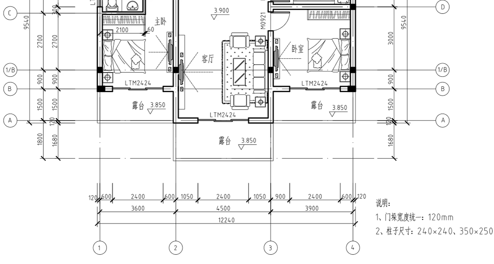
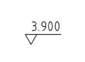
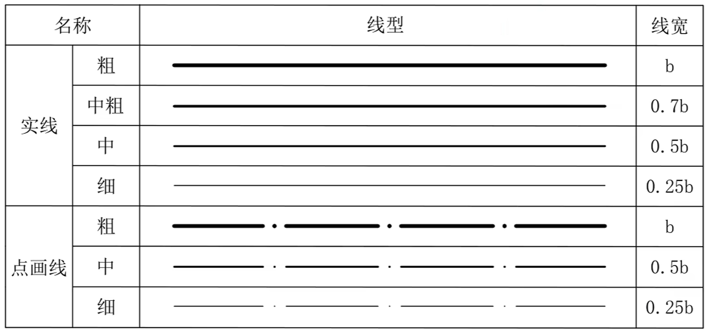
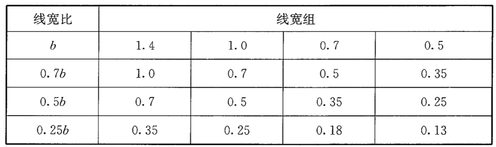
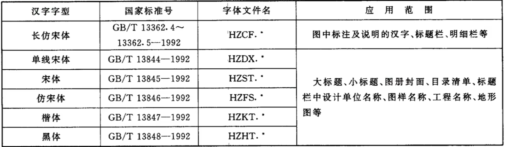
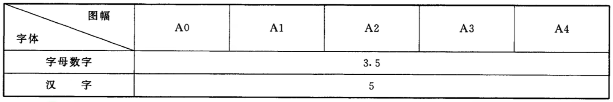

# 识图

## 标注

一般有三道，由内到外

第一道：墙体厚度、窗户尺寸、门洞尺寸

第二道：轴线与轴线之前的尺寸

第三道：最外侧的尺寸，也就是总尺寸

## 门窗

### 窗 LTC1215

LTC表示铝合金推拉窗

12表示长度为1200mm

15表达高度为1500mm

### 门 M0921

M表示门

09表示宽度为900mm

21表示高度为2100mm

## 标高

以米为单位，如下表示高度为3米9

# 线型

## 建筑平面图中常用线型【GB/T17450-1998 3.1】

## 常用线型用途

### 粗实线

用于被剖切的主要建筑构造的轮廓线，如墙体、构造柱

### 中实线

用于门、窗户

### 细实线

用于家具、楼梯

### 细点画线

用于定位轴线

# 线宽

## 图线线宽选择【GB/150001-2017 4.0.1】

b表示图线的基本线宽，按图纸性质从1.4mm、1.0mm、0.7mm、0.5mm线宽系列中选取。

A3一般用 0.7mm基本线宽

A4一般用0.5mm基本线宽

# 文字

## 字体【GB/T18229-2000 4.3.3】

同一图纸字体种类不应超过两种。

在CAD中长仿宋体是 gbenor.shx（SHX字体）、gbcbig.shx (大字体)

## 字体大小

## 字体线宽

打印线宽为0.25mm~0.35mm为宜。

# 绘制

**定位轴线**

线型：点画线

线型比例因子：80

线型颜色：红色

注意：

（1）以上在图层中进行设置

（2）删除不经过墙体的轴线，但经过构造柱的轴线不能删除 

**墙**

线型：粗实线

颜色：青色

ML 多线命令

240墙，就将比例因子调为240

门垛可以设置为120mm

**柱子**

REC矩形命令

填充白色

创建块，拾取点选择几何中心点

**窗户**

窗户为4条中实线，颜色为黄色

可以通过设置多线样式，设置4个偏移实现

**门**

门使用中实线，门厚度可以定为50mm，结合实际宽度，使用矩形命令REC绘制门

门线使用细实线，使用圆弧命令ARC绘制，指定起点、端点、圆心

**标注**

标注样式（dimstyle）

线

- 基线间距 7
- 超出尺寸线 2
- 起点偏移量 2
- 固定长度的尺寸界线 10

符号和箭头

- 箭头：建筑标记

文字

- 长仿宋体 高度3.5

调整

- 文字始终保持在尺寸界线之内
- 全局比例 80

