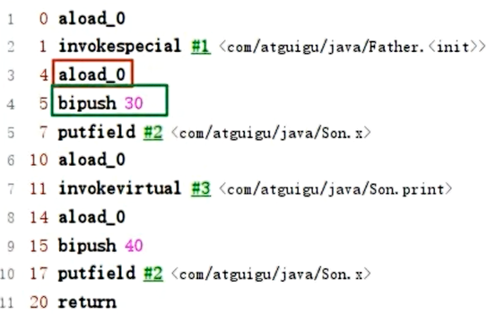

# 什么是字节码指令（byte code）?

Java虚拟机的指令由一个字节长度的、代表着某种特定操作含义的**操作码**（opcode）以及跟随后的零至多个此操作所需参数的**操作数**（operand）所构成。

# 如何解读字节码文件

## 16进制的形式

- Notepad++ 安装HEX-Editor插件 

- javap

## 指令的形式

- IDEA jclasslib插件

- Bytecode viewer

# class文件结构

Class文件的结构不是一成不变的，随着Java虚拟机的不断发展，总是不可避免的会对Class文件结构做出一些调整，但是其基本机构和框架是非常稳定的。

Class文件的总体结构如下：

- 魔数
- Class文件版本
- 常量池
- 访问标识（或标志）
- 类索引，父类索引，接口索引集合
- 字段表集合
- 方法表集合
- 属性表集合

## 魔数（magic number）

class文件的标志

每个class文件开头的4个字节的无符号整数称为魔数

它唯一的作用就是确定这个文件是否为一个被虚拟机接受的有效合法的class文件

魔数的值固定为：0xCAFEBABE

使用魔数而不是扩展名来进行识别主要是基于安全方面的考虑，因为文件扩展名可以随意改动。

## Class版本号

紧接着魔数的4个字节就是版本号，其中前2个代表副版本号minor_version，后2个代表主版本号major_version.

版本号的作用：向下兼容。

## 常量池

常量池可以理解为Class文件中的资源仓库，它是Class文件结构中与其他项目关联最多的数据类型，也是占用Class文件空间最大的数据项目之一。

常量池中，用于存放编译时期生成的各种**字面量**和**符号引用**，这部分那日同将在类加载后进入方法区的运行时常量池中存放。

### 常量池计数器

紧接着版本号的2个字节标识常量池的容量计数值，从1开始，标识常量池中由多少项常量。

constant_pool_count=1表示有0项。 

