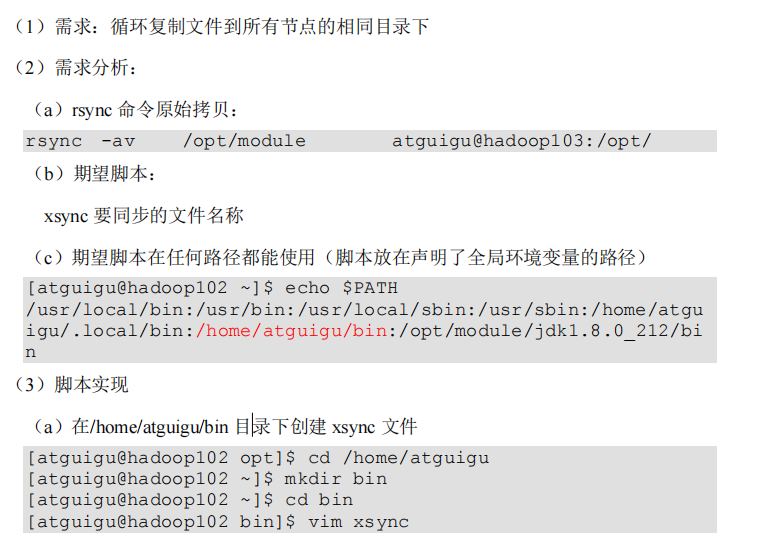
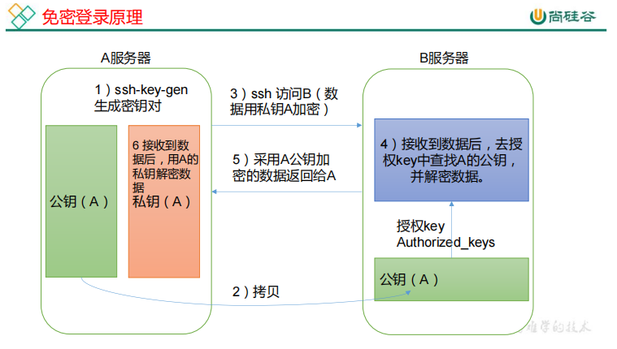
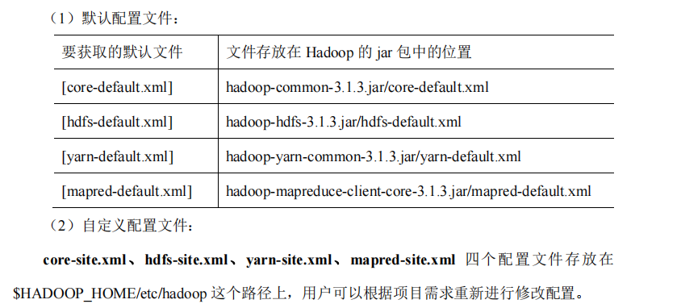
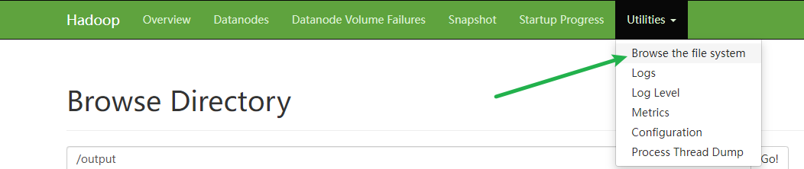

# 1、本地模式
创建在 hadoop-3.1.3 文件下面创建一个 wcinput 文件夹
```bash

# 造一个文本文件
mkdir wcinput
cd wcinput
vim word.txt

# word.txt 内容如下
hadoop yarn
hadoop mapreduce
atguigu
atguigu

# 计算单词出现次数
hadoop jar share/hadoop/mapreduce/hadoop-mapreduce-examples-3.1.3.jar wordcount wcinput wcoutput

# 查看输出
cat wcoutput/part-r-00000

```

输出目录不能存在，否则会抛异常。

# 2、伪分布式


# 3、完全分布式


前面JDK和Hadoop已经在hadoop102上安装了，现在需要从hadoop102上拷贝到hadoop103和hadoop104，这就涉及到服务器之前的文件拷贝。


### scp（安全拷贝）

scp可以实现服务器与服务器之间的数据拷贝。

基本语法：

```bash
  scp   -r    $pdir/$fname             $user@$host:$pdir/$fname
# 命令  递归    要拷贝的文件路径/文件名 <->  目的用户@主机：目的路径/名称
```

```bash
# 实例1 从hadoop102向hadoop103发送文件
scp -r hadoop-3.2.4/ butcher@hadoop103:/opt/module

# 实例2 在hadoop103从hadoop103拉取文件
scp -r butcher@hadoop102:/opt/module/hadoop-3.2.4 /opt/module/

# 实例3 在hadoop103 从hadoop102拷贝文件到hadoop104
 scp -r butcher@hadoop102:/opt/module/jdk1.8.0_411 butcher@hadoop104:/opt/module
```

### rsync（远程**同步**工具）

rsync主要用于备份和镜像。具有速度快、避免复制相同内容和支持符号链接的优点。

rsync和scp的区别：用rsync做文件复制要比scp的速度快，rsync只对差异文件做更新，scp是把所有的文件都复制过去。

基本语法：

```bash
rsync -av $pdir/$fname             $user@$host:$pdir/$fname

-a 归档拷贝
-v 显示复制过程
```

```bash
# 实例
rsync -av /opt/module/hadoop-3.2.4/ butcher@hadoop104:/opt/module/hadoop-3.2.4/
```


### xsync（自定义脚本同步工具）



```bash
#!/bin/bash
#1. 判断参数个数
if [ $# -lt 1 ]
then
    echo Not Enough Arguement!
    exit;
fi
#2. 遍历集群所有机器
for host in hadoop102 hadoop103 hadoop104
do
    echo ==================== $host ====================
    #3. 遍历所有目录，挨个发送
    for file in $@
    do
        #4. 判断文件是否存在
        if [ -e $file ]
        then
            #5. 获取父目录
            pdir=$(cd -P $(dirname $file); pwd)
            #6. 获取当前文件的名称
            fname=$(basename $file)
            ssh $host "mkdir -p $pdir"
            rsync -av $pdir/$fname $host:$pdir
        else
            echo $file does not exists!
        fi
    done
done

```

修改脚本 xsync 具有执行权限

```bash
chmod +x xsync
```

### SSH免密登录



生成公钥与私钥

```bash
[atguigu@hadoop102 .ssh]$ pwd
/home/atguigu/.ssh
[atguigu@hadoop102 .ssh]$ ssh-keygen -t rsa
```

然后敲（三个回车），就会生成两个文件 id_rsa（私钥）、id_rsa.pub（公钥）

将公钥拷贝到要免密登录的目标机器上

```bash
[atguigu@hadoop102 .ssh]$ ssh-copy-id hadoop102
[atguigu@hadoop102 .ssh]$ ssh-copy-id hadoop103
[atguigu@hadoop102 .ssh]$ ssh-copy-id hadoop104
```

### 集群配置

 #### 集群部署规划

- NameNode和SecondaryNameNode不要安装在同一台服务器上，因为他们比较消耗内存
- ResourceManager也很消耗内存，不要与NameNode、SeconddaryNameNode配置在同一台机器上。

|      | haddop102              | haddop103                        | haddop104                        |
| ---- | ---------------------- | -------------------------------- | -------------------------------- |
| HDFS | **NameNode**、DataNode | DataNode                         | **SeconddaryNameNode**、DataNode |
| YARN | NodeManager            | **ResourceManager**、NodeManager | NodeManager                      |

#### 配置文件说明

Haoop配置文件分为两类：默认配置文件、自定义配置文件。



#### 配置集群

以下配置在hadoop102上配置。

（1）核心配置文件，配置 core-site.xml

```xml
<?xml version="1.0" encoding="UTF-8"?>
<?xml-stylesheet type="text/xsl" href="configuration.xsl"?>
<configuration>
    <!-- 指定 NameNode 的地址 -->
    <property>
        <name>fs.defaultFS</name>
        <value>hdfs://hadoop102:8020</value>
    </property>
    <!-- 指定 hadoop 数据的存储目录 -->
    <property>
        <name>hadoop.tmp.dir</name>
        <value>/opt/module/hadoop-3.2.4/data</value>
    </property>
    <!-- 配置 HDFS 网页登录使用的静态用户为 atguigu -->
    <property>
        <name>hadoop.http.staticuser.user</name>
        <value>atguigu</value>
    </property>
</configuration>
```

（2）HDFS 配置文件 hdfs-site.xml

```xml
<?xml version="1.0" encoding="UTF-8"?>
<?xml-stylesheet type="text/xsl" href="configuration.xsl"?>
<configuration>
    <!-- nn web 端访问地址-->
    <property>
        <name>dfs.namenode.http-address</name>
        <value>hadoop102:9870</value>
    </property>
    <!-- 2nn web 端访问地址-->
    <property>
        <name>dfs.namenode.secondary.http-address</name>
        <value>hadoop104:9868</value>
    </property>
</configuration>
```

（3）YARN 配置文件, 配置 yarn-site.xml

```xml
<?xml version="1.0" encoding="UTF-8"?>
<?xml-stylesheet type="text/xsl" href="configuration.xsl"?>
<configuration>
    <!-- 指定 MR 走 shuffle -->
    <property>
        <name>yarn.nodemanager.aux-services</name>
        <value>mapreduce_shuffle</value>
    </property>
    <!-- 指定 ResourceManager 的地址-->
    <property>
        <name>yarn.resourcemanager.hostname</name>
        <value>hadoop103</value>
    </property>
    <!-- 环境变量的继承 -->
    <property>
        <name>yarn.nodemanager.env-whitelist</name>
        <value>JAVA_HOME,HADOOP_COMMON_HOME,HADOOP_HDFS_HOME,HADOOP_CO
        NF_DIR,CLASSPATH_PREPEND_DISTCACHE,HADOOP_YARN_HOME,HADOOP_MAP
        RED_HOME</value>
    </property>
</configuration>
```

（4）MapReduce 配置文件, 配置 mapred-site.xml

```xml
<?xml version="1.0" encoding="UTF-8"?>
<?xml-stylesheet type="text/xsl" href="configuration.xsl"?>
<configuration>
    <!-- 指定 MapReduce 程序运行在 Yarn 上 -->
    <property>
        <name>mapreduce.framework.name</name>
        <value>yarn</value>
    </property>
</configuration>
```

### 在集群上分发配置好的 **Hadoop** **配置文件**

```bash
xsync /opt/module/hadoop-3.1.3/etc/hadoop/
```

### 群起集群

**1）配置 workers**

```bash
vim /opt/module/hadoop-3.1.3/etc/hadoop/workers

hadoop102
hadoop103
hadoop104
```

同步所有节点配置文件

```bash
xsync /opt/module/hadoop-3.1.3/etc
```

**2）启动集群**

(1) 如果集群是第一次启动，需要hadoop102节点格式化NameNode

> 注意：格式化NameNode，会产生新的集群id，导致NameNode和DataNode的集群id不一致，集群找不到以外数据。如果集群在运行过程中报错，需要重现格式化NameNode的话，一定要先停止NameNode和DataNode进程，并且删除所有机器的data和logs目录，然后再进行格式化。

```bash
hadoop102:   hdfs namenode -format
```

（2）启动hdfs

```bash
hadoop102:  sbin/start-dfs.sh
```

（3）启动yarn （注意是在配置了Resource Manager的节点启动）

```bash
hadoop103:  sbin/start-yarn.sh
```

（4）在web查看

HDFS：http://hadoop102:9870/

查看文件



Yarn: http://hadoop103:8088/

3）测试集群

```bash
# 创建文件夹
hdfs dfs -mkdir /input

# 上传文件
hdfs dfs -put wcinput/word.txt /input

# 单词统计计算
hadoop jar share/hadoop/mapreduce/hadoop-mapreduce-examples-3.2.4.jar wordcount /input/word.txt /output

# 删除输出目录
hdfs dfs -rm -r /output
```

> hadoop dfs -mkdir /input
> WARNING: Use of this script to execute dfs is deprecated.
> WARNING: Attempting to execute replacement "hdfs dfs" instead.

如果碰到问题：找不到或无法加载主类org.apache.hadoop.mapreduce.v2.app.MRAppMaster

```bash
# 将返回的地址复制
hadoop classpath

# 编辑yarn配置文件
vim yarn-site.xml

# 添加如下内容
    <property>
        <name>yarn.application.classpath</name>
        <value>/opt/module/hadoop-3.2.4/etc/hadoop:/opt/module/hadoop-3.2.4/share/hadoop/common/lib/*:/opt/module/hadoop-3.2.4/share/hadoop/common/*:/opt/module/hadoop-3.2.4/share/hadoop/hdfs:/opt/module/hadoop-3.2.4/share/hadoop/hdfs/lib/*:/opt/module/hadoop-3.2.4/share/hadoop/hdfs/*:/opt/module/hadoop-3.2.4/share/hadoop/mapreduce/lib/*:/opt/module/hadoop-3.2.4/share/hadoop/mapreduce/*:/opt/module/hadoop-3.2.4/share/hadoop/yarn:/opt/module/hadoop-3.2.4/share/hadoop/yarn/lib/*:/opt/module/hadoop-3.2.4/share/hadoop/yarn/*</value>
    </property>
```

